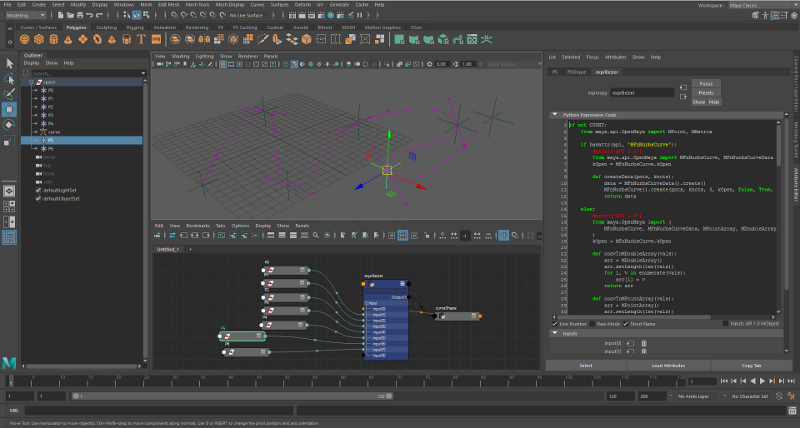
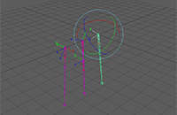
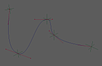
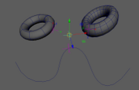
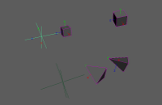
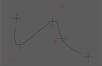
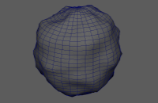
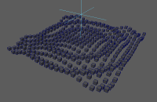
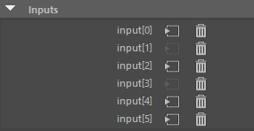

# maya_exprespy
Maya で Python によるエクスプレッション機能を提供するノードのプラグインです。
exprespy（エクスプレスパイ）と呼びます。




## 特徴
本プラグインは実行速度を重視し、C++ でノードが実装されています。
また、それによって、Pythonエクスプレッションコードはコンパイルされたものがメモリに保持され、
効率的に実行されるようになっています。

また、エディタ（アトリビュートエディタ）上では、標準のエクスプレッション機能と同様に
実際のノード・アトリビュート名でのコーディングが可能です。
それらは、標準機能と同様に、実際はノードのコネクションに置き換えられるようになっています。
ただし、単位変換の機能はなく常に内部単位で扱われるという点が標準機能と異なります。
これだけが少し初心者向けでない部分ですが、効率重視たる所以です。

さらに、Python API 2.0 の型に対応し、double3 や matrix アトリビュートはもちろんのこと、
ジオメトリデータなどあらゆるデータ型を直接入出力することが可能です。

Maya バージョンに応じて Python 2.x と Python 3.x に両対応しています。

[制限事項](#limitation) をご一読の上ご利用ください。


## 類似技術
標準で付属する MASH には Python ノードがあり、Python でモーショングラフィックスを制御することが出来ます。
ただ、それは particle データを制御する仕組みで、それに特化された性能は素晴らしいですが汎用的なものではありません。

また、Python で通常のエクスプレッションを書けるようにするプラグインは
[SOuP](http://www.soup-dev.com/)
に含まれる
[pyExpression](http://www.soup-dev.com/wiki/PyExpression.html)
ノードが有名です。
しかし、それは全て Python で実装されており、
Python のエクスプレッションコードは exec() 関数によって実行される仕組みで、
実行するたびにコードをコンパイルするため効率的ではありません。
私はこのプラグインの志に惹かれ、より良いものをと思い exprespy を作りました。


## ディレクトリ構成
* [examples](examples): Mayaシーンの例。
* [plug-ins](plug-ins): ビルド済みプラグインバイナリ。
* [python](python): サポート python モジュール。
* [scripts](scripts): サポート mel スクリプト。
* [srcs](srcs): C++ソースコード。
* [viewTemplates](viewTemplates): ノードエディタのためのテンプレート。


## インストール方法
* plug-ins フォルダにあるプラットフォームとバージョンごとのフォルダに収められているファイルを
  MAYA_PLUG_IN_PATH の通ったフォルダにコピーします。
  (My Documents)\maya\\(version)\plug-ins でも OK です。

  Maya 2022 以降の場合、フォルダ名に py2 を含むものが Python 2 用、含まないものが Python 3 用です。

* python フォルダにあるファイルを PYTHONPATH の通ったフォルダにコピーします。
  (My Documents)\maya\scripts でも OK です。

* scripts フォルダにあるファイルを MAYA_SCRIPT_PATH の通ったフォルダにコピーします。
  (My Documents)\maya\scripts でも OK です。

* viewTemplates フォルダにあるファイルを MAYA_CUSTOM_TEMPLATE_PATH の通ったフォルダにコピーします。
  設定されていなければ (My Documents)\maya\\(version)\prefs\viewTemplates で OK です。


## サンプルシーン
* [bend_roll.ma](examples/bend_roll.ma)

  

  [rotationDriver](https://github.com/ryusas/maya_rotationDriver) のサンプルをエクスプレッションで置き換えてみたもの。

  この程度のノード実装であればエクスプレッションで十分実現可能なことが分かります。

  本来は Maya の Parallel モードの恩恵を受けるためにも、ノードは C++ で実装するのが一番なのですが、
  Python でノードプラグインを実装するくらいなら多くの場合 exprespy で十分です。

* [bezierCurve.ma](examples/bezierCurve.ma)

  

  ベジェカーブの接線を自動的に制御する例。カーブリグのコントロールなどで有効と思います。

  これは、エクスプレッションからシェイプデータを出力する例でもあります。

  各CVに対応したロケータを移動させると、カーブが滑らかになるように接線が制御されます。
  ロケータを回転やスケールさせて、自動制御された接線をさらに操作することも出来ます。
  bezierCurve シェイプノードに追加した closed アトリビュートを ON にすると閉じたカーブになります。
  入力ポイントの増減にはリアルタイムに追従するようになっていて、
  アトリビュートエディタの Inputs フレーム内の GUI で入力を削除したり、
  ノードエディタで接続を追加したり切断したりすることが出来ます。

  exprespy は、Python API 1.0 と 2.0 のオブジェクト出力を自動判別することが出来るので、
  2.0 で nurbsCurve 制御が可能なバージョンなら 2.0 を、そうでないなら 1.0 を使用するという
  実装をしており、2012 以降の全バージョンで動作します。
  if 文で切り分けて両方の実装がコーディングされています。1.0 に比べて 2.0 だとすっきりと書け、
  実行速度が高速であることも比較できると思います。

* [closestPoints.ma](examples/closestPoints.ma)

  

  入力ロケータに対し mesh、nurbsSurface、nurbsCurve のそれぞれの表面上の近い点を算出し
  それぞれに対応する３つのロケータの位置を拘束する例。
  mesh と nurbsSurface では、表面の法線や接線も得て、ロケータの向きも拘束しています。

  これは、エクスプレッションにシェイプデータを入力する例でもあります。

  Python API 2.0 では、シェイプデータを処理する機能の多くは 2016 で搭載されました。
  この例では、それより前のバージョンでも動作するように 1.0 で実装しています。
  1.0 用のシェイプデータを入力するために、個々の exprespy ノードの `Inputs API 1.0 MObject` を ON にしています。

* [closestPoints2016.ma](examples/closestPoints2016.ma)

  

  [closestPoints.ma](examples/closestPoints.ma) を 2016 以降に最適化した例。
  入力されたシェイプデータの処理には Python API 2.0 を用いています。
  1.0 に比べて非常にすっきりと書け、また実行速度も高速です。
  ただ、ワールドスペースでのクエリがうまくいかなかったため（2.0 の問題でしょうか）、
  入力に transformGeometry ノードを挿入しています。

  Python エクスプレッションには、
  [noiseDeformer.ma](examples/noiseDeformer.ma) のように全頂点を出力処理する操作は荷が重いですが、
  このように入力シェイプを参照して何かをする用途には有効に使えるのではないかと思います。

* [constraints.ma](examples/constraints.ma)

  

  様々なコンストレイン機能をエクスプレッションで実装した簡単な例。最初に見るのにお勧めです。

  position、orient、アップオブジェクト無しの aim、アップオブジェクト有りの aim を実装しています。

* [epcurve.ma](examples/epcurve.ma)

  

  ロケータで制御点列を与えることで滑らかなカーブが生成されるという点で、
  見た目の結果が [bezierCurve.ma](examples/bezierCurve.ma) に近いのですが、
  こちらは EP Curve Tool でカーブを描く操作を動的に行うことで制御しています。

  単に API の機能を呼び出しているに過ぎませんので、コードは比較的短めです。

  ただ、こちらの手法ですと、接線の手動制御は出来ませんし、
  局所的な変更がカーブ全域に及んでしまうという問題もあり、
  実際のリグではベジェカーブの方が有効だと思います。

* [noiseDeformer.ma](examples/noiseDeformer.ma)

  

  シンプルなノイズデフォーマーの実装例です。
  time を入力しているのでアニメーションします。
  mesh の transform ノードに、ノイズの制御アトリビュートがいくつか追加されています。

  これは、エクスプレッションにシェイプデータを入力し、さらに出力するという例でもあります。

  ここで行っている mesh の処理は Python API 2.0 の最初のバージョンから可能ですので、
  すべて 2.0 で実装していますので、比較的コードはすっきりしています。
  ただし、ノイズ関数もエクスプレッション中に実装したのでコードは長めです。

  この程度の頂点数でもそれなりに重いので、やはり大量の頂点をリアルタイムに処理するのは
  Python API 2.0 でも厳しいようです。
  やはり、メッシュデフォーメーション用途では、それに特化した taikomatsu 氏の
  [SeExprMesh](https://github.com/taikomatsu/SeExprMeshMaya) 等の方が向いていると思います。

* [ripple.ma](examples/ripple.ma)

  

  [SOuP](http://www.soup-dev.com/) の pyExpression のサンプルを速度比較のために置き換えたてみたもの。
  dgtimer でノードの処理速度のみを比較すると、なんと約15倍高速化されています。
  フレームレート比較では描画負荷などもあるため純粋なノードの性能比較ほどの差はありませんし、
  環境によっても変わりますが、私の環境では3.5倍程度の高速化でした。

  また、アトリビュート名でコーディングせず、``IN`` や ``OUT`` で書くためのごく簡単な例でもあります。


## 使用方法
エクスプレッションを記述するには、まず exprespy ノードを生成します。
以下のような方法が利用できます。

* プラグインをロードしてから、以下の mel コードを実行。またはノードエディタ等でノード作成。

  ``` py
  createNode exprespy;
  ```

* または、以下の Python コードを実行（プラグインはロードされていなくてもOK）。

  ``` py
  import exprespy
  exprespy.create()
  ```

その後、生成された exprespy ノードのアトリビュートエディタにコードを入力します。

使い方は標準エクスプレッション機能とだいたい同じで、
コード中に書いた `ノード名.アトリビュート名` の部分が実際の入出力に置き換えられます（
`=` で入力している左辺が出力に、それ以外は入力と識別されます）。

エディタは標準のスクリプトエディタと同じコントロールを採用しています（
PySide（2014以降は標準搭載）か PyQt が使えない環境ではシンプルなエディタになります）。
各種ショートカットキーも同じです。
TabキーでのインデントがTabになるかSpaceになるかの設定も引き継がれます。

エディタの下には以下のようなチェックボックスが在ります。
エディタとの境界線を調整することで、エディタのサイズを調整出来ます。


- Line Number: エディタの行番号の表示を ON/OFF する UI 設定です。
- Raw Mode: ローモードを ON/OFF する UI 設定です。
  詳しくは、詳細仕様の [コードの保存の仕組みと IN と OUT の活用方法](#rawmode) を参照してください。
- Short Name: アトリビュート名を短い名前で表示するかどうかを ON/OFF する UI 設定です。
- Inputs API 1.0 MObject: その exprespy ノードで、シェイプ等のデータ型の入力を API 1.0 に切り替えます。
  これだけがノードごとの設定（ノードの持つアトリビュート）です。
  詳しくは、詳細仕様の [入力アトリビュートの型](#input) を参照してください。

さらに下には、入力要素を直接管理する UI が在ります。



通常は使用する必要はありませんが、
詳しくは、詳細仕様の [コードの保存の仕組みと IN と OUT の活用方法](#rawmode) を参照してください。


## 詳細仕様

* 内部単位での扱い

  単位付きアトリビュートは入出力とも内部単位で扱われます。
  time は秒、
  doubleLinear(distance) は centimeter 、
  doubleAngle は radian
  での扱いとなります。


* 入出力と依存関係

  入力として参照したアトリビュートは exprespy ノードの input[] アトリビュートに、
  出力として参照した（ = で代入した）アトリビュートは output[] アトリビュートに接続されます。
  それらの型は generic で、何を繋いでも unitConversion ノードは挟まらず効率的に動作します。

  全ての出力は全ての入力に依存することになります。コード上の論理的な依存関係は関係ありません。
  よって、シーン中の全ての処理を一つの exprespy ノードに書くのは良くありません。
  こういった考え方や仕組みは標準の expression ノードと全く同じものです。


* <a name="input"> 入力アトリビュートの型

  入力アトリビュートの型は Python では以下のように扱われます。

  |Mayaアトリビュートの型|Pythonの型|
  |--:|:--|
  |bool|int (注1)|
  |整数型 (short, long, enum 等)|int|
  |実数型 (double, float 等)|int か float (注2)|
  |単位付き実数型 (time, distance, angle)|int か float (注2)|
  |string|unicode (py3以降はstr)|
  |matrix|API 2.0 MMatrix (注3)|
  |double3|API 2.0 MVector (注3)(注4)|
  |double3 以外の数値コンパウンド型|int か float の list (注3)(注4)|
  |その他の型（シェイプデータ等）|API 2.0 MObject (API 1.0 に切り替え可能 (注5)|
  |null や異常事態の場合|None|

  - (注1): 数値アトリビュート入力の型判別が出来ないため、残念ながら bool は int になってしまいます。
  - (注2): 数値アトリビュート入力の型判別が出来ないため、基本は float ですが整数化可能なら int となります。
  - (注3): 入力された MMatrix や MVector や list をエクスプレッション内で書き換えてしまっても問題ありません。
  - (注4): 数ある数値コンパウンド型の中で double3 のみ利便性と過去の経緯から MVector となります。MPoint や MEulerRotation が欲しい場合は変換してください。その他は全て list になりますので、必要に応じて欲しい型に変えてください。例えば double4 は自動的には MQuaternion になりません。
  - (注5): 個々の exprespy ノードの `Inputs API 1.0 MObject`（`inputsAPI1` アトリビュート）を ON にすると MObject のみが API 1.0 に切り替わります。


* <a name="output"> 出力アトリビュートの型

  Python の出力は Maya では以下のようなアトリビュート型になります。

  |Pythonの型|Mayaアトリビュートの型|
  |--:|:--|
  |bool|bool (注1)|
  |int|long (注1)|
  |long (py2のみ)|long (注1)|
  |float|double (注1)(注2)|
  |str (py3以降はbytes)|string|
  |unicode (py3以降はstr)|string|
  |API 2.0 MMatrix|matrix|
  |API 2.0 MVecotr|double3 (注2)|
  |API 2.0 MPoint|double3 (注2)|
  |API 2.0 MEulerRotation|double3 (注2)|
  |API 2.0 MQuaternion|double4 (注2)|
  |API 2.0 MColor|float3|
  |API 2.0 MFloatVector|float3|
  |API 2.0 MFloatPoint|float3|
  |sequence (list や tuple 等)|適切な数値コンパウンド型 (注2)(注3)|
  |API 2.0 MObject|データ型ならそのまま|
  |API 1.0 MObject|データ型ならそのまま|
  |その他の認識できないもの|無視|

  - (注1): 型が完全に一致しなくても、あらゆるスカラー数値型（単位付き数値型も含む）を接続可能です。
  - (注2): 単位付き実数型 (time, distance, angle) も unitConversion ノード無しで接続可能です。
  - (注3): 数値コンパウンドには short2, short3, long2, long3, double2, double3, double4, float2, float3 といったものがあり、どれも接続可能です。Python sequence の長さが 4 を超えていても 4 で打ち切られます。


* スコープ

  個々の Python エクスプレッションコードはそれぞれ独立したグローバルスコープで動きます
  （バージョン 1.0 では Maya Python のグローバルスコープの名前を参照出来ましたが、
  実装が修正されそれは不可能になりました）。

  個々のグローバルスコープは、コードが編集されコンパイルし直されるまで保持されます。
  それによって、例えば、状態を記憶して次の実行で再利用したり、
  最初の一回だけ実行される初期化処理を書くことが可能です。


* モジュール

  Python エクスプレッションコードでは、以下のモジュールがインポート済みで使える状態となっています。

  ``` py
  import sys
  import math
  import maya.api.OpenMaya as api
  import maya.OpenMaya as api1
  import maya.cmds as cmds
  import maya.mel as mel
  ```

  他に必要なモジュールがあれば自由に import してください
  （一般的に import 文の負荷は高めなので、初期化処理で行う実装を推奨）。


* 特殊変数

  - `COUNT`

    コードがコンパイルされてからの実行カウントです。
    コードを変更したりファイルを開いたりした後からそれが何回実行されたかです。
    初回呼び出しでは 0 なので、それを判別して初期化処理を書くことが出来ます。

  - `IN`

    入力アトリビュート値が格納されている dict です。
    キーは input[] アトリビュートのインデックスです。
    list でないのは、アトリビュートと同様に欠番に対応するためです。

    実行されるたびにこの dict 全体が再セットされます。

  - `OUT`

    出力アトリビュート値を格納する dict です。
    キーは output[] アトリビュートのインデックスです。
    list でないのは、アトリビュートと同様に欠番に対応するためです。

    実行されるたびにこの dict はクリアされます。
    これに値をセットすると、実際にそのインデックスのアトリビュートが存在すれば出力されます。


* <a name="rawmode"> コードの保存の仕組みと `IN` と `OUT` の活用方法

  コードは exprespy ノードの code という string アトリビュートに保存されます。
  コード内のアトリビュート参照は `IN[index]` や `OUT[index]` の特殊変数参照に置き換わります。
  実際のアトリビュートは、それらに対応した `input[index]` と `output[index]` に接続されます。

  アトリビュートエディタ上に見えているコードは `IN` や `OUT` を置き換えた仮のコードです。
  この処理は exprespy の Python モジュールが行っています。

  通常はこれらの変数の存在を意識する必要はありませんが、
  この仕様を理解していれば、ノードエディタやスクリプト等でコネクションを直接編集し、
  エディタ上のコードに `IN` や `OUT` とインデックスを直接コーディングしても構いません。
  大量の入出力をループ処理する場合などに便利です（
  `IN[i]` のようにキーを変数でコーディングしているものはエディタ上でアトリビュート名にされてしまうことが回避されます）。
  また、標準エクスプレッション機能では不可能な exprespy ノード同士を連結することも出来るでしょう

  アトリビュートエディタ上にある **Raw Mode** を ON にすると、
  `IN` と `OUT` の名前置換と自動接続・切断処理が一切行われなくなりますので、
  よりテクニカルな編集が出来ます。
  最初は自動接続に任せて軽くコーディングして入出力がフィックスした後にモードを切り替えても良いでしょう。

  接続・切断処理をエディタの自動処理に任せる場合は、
  `input` や `output` の要素の削除処理や場合によっての維持も自動的に行われます。
  自分で接続処理する場合は多少の意識が必要です。
  まず `output` の各要素は接続が切断されると自動消滅するようになっています。
  一方で `input` の各要素は接続が切断されても自動消滅しません。
  これは Maya の複雑な問題回避（接続によってはUndoした場合に状態が戻らないことがあるなど）
  の意図もありますが、 **接続の無い値だけの要素も利用可能にする** 意図もあります。
  例えば、何かを接続してから切断する、または直接 `setAttr` するなどして値を設定した場合も
  入力として通常通り扱うことが出来ます。

  

  `input` の要素を削除するには、アトリビュートエディタの Inputs フレーム内の GUI が便利です。
  上流のコネクションを意味するボタンがグレーアウトしているかどうかで入力の有無を判別できます。
  要素を削除するにはゴミ箱ボタンをクリックします。


## <a name="limitation"> 制限事項
* Python である以上は避けられない宿命ですが、
  2016 以降の Maya の Parallel モードであっても
  Python を実行するノード（exprespy ノード、MASH_Python 等の他のノード、または Python で実装されたプラグインノード）
  同士は決して並列実行されません。
  これは [GIL](https://en.wikipedia.org/wiki/Global_interpreter_lock) の仕組みによるものです。

  2015 以前の Maya であれば exprespy は非常に価値のあるプラグインだと思いますが、2016 以降での価値は少し下がります。
  Python に関係の無い他のノードとは並列化されますし、その点では
  [標準の expression ノードと同じ](http://download.autodesk.com/us/company/files/2017/UsingParallelMaya.pdf)
  です。
  また、標準 expression や Python の仕組み以外にも並列化を妨げる多くの伝統的な機能を Maya 自身が持っているため、
  実際のプロダクションデータにおいて並列化がスムースにはいきにくいのが現状です。
  そんな現状においては exprespy は便利な機能に違いありませんが、並列化という大きな方向性には逆らうソリューションであることは否定出来ません。

  とはいえ、標準 expression を使ったり、Python プラグインノードを作るくらいなら、exprespy は価値があるものと考えられます。
  また、ノード開発やリギングのプロトタイピングにも非常に有効だと考えます。

* コード内には日本語などの非ASCII文字は出来るだけ含めないことを推奨します。
  もし、記述する場合は、通常のスクリプトと同様に、最初の行コメントにエンコーディング名を書いてください。
  日本語Windows では `cp932` 、簡体中国語Windows では `cp936` 、 Linux や Mac では `utf-8` です。
  これは
  [Mayaの仕様](https://knowledge.autodesk.com/ja/support/maya/learn-explore/caas/CloudHelp/cloudhelp/2015/JPN/Maya/files/Running-Maya-in-Japanese-Prepare-Maya-files-containing-Japanese-text-htm.html)
  によるものです。
  そして、残念ながら、プラットフォーム間でのファイルの受け渡しの際には注意が必要です（詳しくはリンク先の記事をお読みください）。

* コード内のアトリビュート参照が識別されてコネクション化される仕組みは、正規表現を使ったとても簡易的な実装です。
  - コメントや文字列リテラルを特に識別していないため、
    その中に実際のアトリビュートにマッチする名前があるとコネクションに置き換えられてしまいます。
  - 出力としての左辺の認識は `=` での代入で判別しています。
    `+=` や `-=` などは判別されません。
    左辺をシーケンスとした一括代入も判別されません。
  - もし、識別の挙動がおかしい場合は、諦めて Raw Mode を活用すれば確実です。

* MObject の入出力は少し非効率的な実装になっています（MDataBlock ではなくMPlug を経由しています）。
  MObject を C++ と Python の間で受け渡す良い方法が他に無いからです。

* Maya のクォータニオンのアトリビュート型は統一されておらず、double4 の場合と、一般的な compound の場合の2通りがあります。たとえば、decomposeMatrix ノードの outputQuat や transform ノードの rotateQuaternion アトリビュートは double4 型ですが、quaternionNodes プラグインの提供する様々なノードのクォータニオンは一般 compound 型です。とはいえ、異なる型のアトリビュート同士を接続しても問題なく値をやりとりできます。

  しかし exprespy の generic 型アトリビュートでは問題があります。exprespy では double4 型を問題なく入出力できますが、compound 型の quaternion 値を入力することはできません。出力は問題ありません（exprespy としては double4 データを出力しているだけですが、compound 型は問題なく受け取れるようです）。

  一般 compound 型 quaternion 値を入力したい場合は x, y, z, w 要素を個別に接続することで対応してください。


## 改訂履歴
* 2022.07.02: exprespy 3.0.1.20220627
  - double4 型データ出力が実装ミスにより動作していなかったのを修正。

* 2022.04.29: exprespy 3.0.0.20220429
  - エディタ上にアトリビュートのショート名が正しく表示されない場合がある不具合を修正（利用していたlsコマンドのバグと思われる）。

* 2021.04.11: exprespy 3.0.0
  - Python 3 に対応。
  - unicode 文字列を string アトリビュートに出力する処理を改善（コードで指定されたエンコードタイプに依存せず unicode のまま処理）。
  - サンプルシーン [noiseDeformer.ma](examples/noiseDeformer.ma) を Python 3 でも動くように修正。

* 2018.08.28: exprespy 2.0.2
  - Parallel の効率が少しでも良くなるように、スケジューリングタイプを GloballySerial に設定。

* 2017.08.20: exprespy 2.0.1
  - スクリプト編集時に入力コネクションがおかしくなることがあるバグを修正。

* 2016.11.06: exprespy 2.0.0
  - シェイプデータ等あらゆる型の入出力に対応。
  - あらゆる数値コンパウンド型の取り扱いを python list としてサポート。
  - エディタの機能強化（標準スクリプトエディタと同じコントロールを導入）。
  - エディタのサイズを調整可能に。
  - Raw Mode を追加。
  - Short Name モードを追加。
  - 特殊変数 COUNT を追加。
  - アトリビュート自動接続切断処理の改善（接続の無い値の維持、一度決まったインデックスの維持など）
  - デフォルトでインポートされるモジュールを追加。
  - コード中に書いた関数が正常に動作しない問題を修正（グローバル変数にアクセス出来なかった）。
  - コード中のprint文やエラーメッセージのスタックトレースの行の順番が逆転することがある問題を修正。
  - サンプルシーンに [bend_roll.ma](examples/bend_roll.ma) を追加。
  - サンプルシーンに [bezierCurve.ma](examples/bezierCurve.ma) を追加。
  - サンプルシーンに [closestPoints.ma](examples/closestPoints.ma) を追加。
  - サンプルシーンに [closestPoints.ma](examples/closestPoints2016.ma) を追加。
  - サンプルシーンに [epcurve.ma](examples/epcurve.ma) を追加。
  - サンプルシーンに [noiseDeformer.ma](examples/noiseDeformer.ma) を追加。

* 2016.10.22:
  - ネームスペースやパス区切りの含まれるノード名を識別出来ていなかったバグを修正。

* 2016.10.18:
  - コード中に同じアトリビュート参照が複数存在した場合に間違ったコネクションが作られることがあったバグを修正。

* 2016.10.06:
  - アトリビュートエディタを改善。識別していないコネクションが維持されるようにした。
  - [viewTemplates](viewTemplates) 追加。ノードエディタで扱いやすくなる。
  - プラグインを更新。compiled アトリビュートを hidden にした。
  - サンプルシーンに [ripple.ma](examples/ripple.ma) 追加。

* 2016.10.2: 初版
